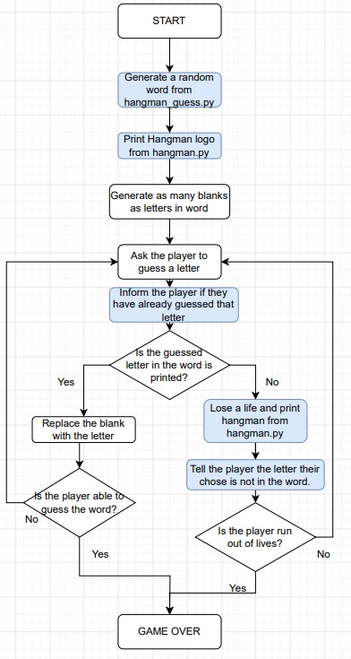

# HANGMAN: Game of thinking

### What is Hangman game?
Hangman is a word-guessing game that is often played between two people. One person thinks of a word and draws a blank line for each letter in the word. The other person tries to guess the word by suggesting letters. For each incorrect guess, a part of a stick figure (representing a "hangman") is drawn. The goal is to guess the word before the hangman is fully drawn.

## The game typically follows these steps:

- The word-chooser(random) thinks of a word and draws a blank line for each letter in the word. The blanks are usually represented by underscores.

- The guesser suggests a letter.

- If the suggested letter is in the word, the word-chooser fills in all instances of that letter in the blanks.

- If the suggested letter is not in the word, a part of the hangman is drawn. This could be the head, body, arms, legs, etc.

- The game continues with the guess...

  ## How hangman game works
  

### Target Audience

Educational word game for all ages, fostering language and social interaction.

## Technologies Used

**Github** - Used for storage of my site and for publishing online.\
**Codeanywhere** - The IDE used for editing my site and pushing changes.\
**Python**-The logic behind adding, subtract, and multiply.
**Googledrive** - Present the flowchart

## Deployment

I deployed my websites which includes all pages. The site was deployed to GitHub pages.

- The steps to deploy are as follows:
  - In the GitHub repository, navigate to the Settings tab
  - From the source section drop-down menu, select the Master Branch
  - Once the master branch has been selected, the page will be automatically refreshed with a detailed ribbon display to indicate the successful deployment.

The live link can be found here - https://samakinbile.github.io/Hangman/

## Credits
- [Codeinstitute](https://learn.codeinstitute.net/ci_program/diplomainsoftwaredevelopmentecomm)

#### Content
- The ascii use in this project was provided by [ascii art](https://ascii.co.uk/art)